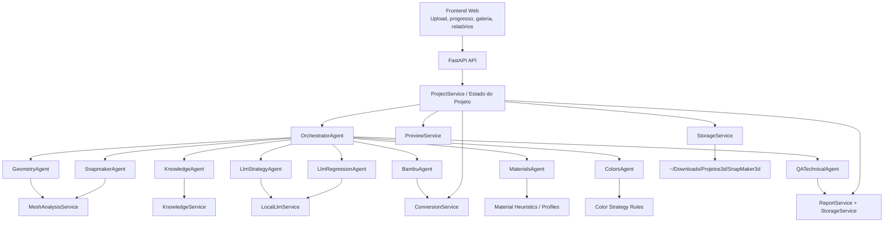

# SnapMaker3d Studio - Arquitetura Definitiva

## Objetivo arquitetural

Esta arquitetura existe para garantir quatro coisas ao mesmo tempo:

1. escalabilidade de processamento e evolução;
2. reuso de componentes entre diferentes tipos de projeto;
3. previsibilidade operacional em conversões complexas;
4. bloqueio de entregas inseguras antes da exportação final.

O princípio central é:

- **multiagente para decisão e interpretação**;
- **serviços determinísticos para transformação crítica**;
- **orquestração central para governança do fluxo**;
- **QA como gate obrigatório de entrega**.

## Decisão principal

O sistema **não** deve concentrar tudo em um agente único.

Ele deve operar como **multiagente com orquestração forte**, porque:

- geometria, slicer, materiais, cores e compatibilidade Bambu são domínios diferentes;
- cada domínio precisa evoluir sem quebrar o restante;
- a execução crítica não pode depender apenas de inferência probabilística;
- o sistema precisa continuar confiável mesmo quando um agente for pulado, degradado ou substituído.

## Princípios obrigatórios

- Toda decisão crítica que afeta imprimibilidade precisa terminar em uma transformação determinística ou em um bloqueio explícito.
- Nenhum agente pode marcar um projeto como concluído sozinho.
- O estado do projeto precisa ser persistido por etapa.
- Toda saída gerada precisa ser rastreável por versão, artefato e relatório.
- Perguntas ao usuário são obrigatórias apenas quando a ambiguidade altera estrutura, segurança de impressão, cor canônica ou material final.
- O LLM local é assistivo, nunca a única fonte de verdade para transformações geométricas ou de slicer.

## Visão em camadas



## Componentes e responsabilidades

### 1. Frontend

Responsável por:

- receber upload;
- mostrar progresso por etapa;
- mostrar perguntas pendentes;
- mostrar caminho de saída;
- mostrar galeria de previews;
- disponibilizar artefatos, relatórios e logs.

Não deve:

- tomar decisões de processamento;
- inferir status real sem consultar o backend;
- aplicar regra de negócio crítica.

### 2. API FastAPI

Responsável por:

- expor endpoints de upload, detalhe, processamento e conhecimento;
- validar payloads;
- iniciar o pipeline;
- servir metadados para o frontend.

Não deve:

- concentrar lógica de negócio complexa nas rotas;
- misturar decisão de orquestração com serialização HTTP.

### 3. `ProjectService`

É o **motor de estado da execução**.

Responsável por:

- criar projeto/versionamento;
- montar o contexto do pipeline;
- persistir `processing_stages`;
- agregar artefatos, previews, relatórios e logs;
- consolidar `findings`, `risks` e `questions_pending`;
- chamar orquestração e QA final.

Ele é o ponto de integração entre API, orquestração e filesystem.

### 4. `OrchestratorAgent`

É o **controlador lógico** do pipeline.

Responsável por:

- definir a sequência de execução;
- ativar apenas agentes necessários ao caso;
- receber saídas padronizadas;
- consolidar perguntas pendentes;
- sinalizar progresso de cada etapa.

Não deve:

- fazer parsing profundo de arquivos;
- editar `3MF` diretamente;
- substituir serviços determinísticos.

### 5. Agentes especialistas

#### `GeometryAgent`

Responsável por:

- interpretar a análise de malha;
- decidir se reparo simples deve rodar;
- expor riscos de escala, malha aberta, overhang e adesão.

#### `KnowledgeAgent`

Responsável por:

- reaplicar regras aprendidas com incidentes anteriores;
- acionar ações preventivas relevantes ao contexto.

#### `LlmStrategyAgent`

Responsável por:

- usar o LLM local para consolidar um plano curto;
- apontar ambiguidades complementares;
- apoiar a priorização.

Limite:

- não executa transformação crítica;
- não substitui heurísticas determinísticas.

#### `SnapmakerAgent`

Responsável por:

- decidir suporte;
- decidir estratégia de primeira camada;
- validar envelope útil;
- orientar risco de espessura e orientação para FDM.

#### `BambuAgent`

Responsável por:

- inspecionar `3MF/Bambu`;
- acionar a conversão compatível;
- registrar o que foi preservado, adaptado e perdido.

#### `MaterialsAgent`

Responsável por:

- sugerir material e perfil base;
- justificar resumidamente a escolha;
- alertar quando a inferência for fraca.

#### `ColorsAgent`

Responsável por:

- preservar estratégia de cor do projeto;
- evitar afirmar cor canônica sem base;
- manter separação multicolor quando detectada.

#### `LlmRegressionAgent`

Responsável por:

- gerar checklist preventivo adicional;
- reforçar validações contra erros já observados.

#### `QATechnicalAgent`

Responsável por:

- validar estrutura obrigatória;
- verificar se suporte/adesão requeridos foram preservados;
- impedir que o resultado seja tratado como definitivo quando houver pendências.

## Serviços determinísticos

### `StorageService`

Responsável por:

- layout de pastas;
- versionamento de projeto;
- versionamento de artefatos;
- serialização de manifestos;
- mapeamento para URLs `/storage/...`.

### `MeshAnalysisService`

Responsável por:

- inspeção de malha;
- métricas geométricas;
- estimativa de suporte;
- estimativa de adesão da primeira camada;
- reparos simples onde aplicável.

### `ConversionService`

Responsável por:

- sanitização de `3MF`;
- regravação de configurações de slicer;
- neutralização de parâmetros proprietários Bambu;
- inline de geometria externa;
- flatten de itens compostos;
- normalização de layout;
- split de plates/exportações.

### `PreviewService`

Responsável por:

- coletar imagens do projeto;
- extrair previews de `3MF`;
- manter galeria de artefatos.

### `ReportService`

Responsável por:

- gerar bundle técnico JSON/Markdown;
- consolidar rastreabilidade de entrega.

### `KnowledgeService`

Responsável por:

- armazenar regras operacionais;
- registrar incidentes reais;
- associar padrões de falha a ações preventivas.

### `LocalLlmService`

Responsável por:

- integrar com o `ollama`;
- produzir JSON controlado;
- degradar com segurança quando indisponível.

## Contrato padrão entre agentes

Todo agente deve devolver o mesmo envelope:

```json
{
  "status": "ok",
  "etapa": "analise_e_reparo_de_malha",
  "achados": [],
  "riscos": [],
  "perguntas_ao_usuario": [],
  "acoes_executadas": [],
  "artefatos_gerados": [],
  "caminho_de_saida": "/Users/usuario/Downloads/Projetos3d/SnapMaker3d/projeto_x",
  "extra": {}
}
```

Regras:

- `status` deve ser `ok`, `partial`, `failed` ou `skipped`;
- `artefatos_gerados` só pode listar arquivos realmente escritos;
- `extra` pode carregar planos intermediários, nunca o estado inteiro do projeto;
- agentes não devem escrever em manifestos diretamente.

## Ordem de execução recomendada

```text
1. upload
2. análise inicial
3. GeometryAgent
4. KnowledgeAgent
5. LlmStrategyAgent
6. SnapmakerAgent
7. BambuAgent (quando aplicável)
8. MaterialsAgent
9. ColorsAgent
10. LlmRegressionAgent
11. geração de relatórios
12. QATechnicalAgent
13. conclusão ou awaiting_user
```

## Critérios de bloqueio e liberação

### O projeto pode seguir automaticamente

Quando:

- a análise não encontrou ambiguidade crítica;
- suporte e adesão foram decididos deterministicamente;
- o envelope da máquina é respeitado ou o split foi executado;
- a conversão gerou artefatos válidos;
- o QA não encontrou inconsistência bloqueante.

### O projeto deve ir para `awaiting_user`

Quando houver:

- conflito entre reduzir escala e dividir em partes;
- material final com impacto funcional sem contexto suficiente;
- cor canônica/variante visual sem base suficiente;
- ambiguidade estrutural com efeito real na peça final;
- limitação técnica assumida mas não resolvida automaticamente.

### O projeto deve falhar

Quando:

- não houver geometria válida;
- o arquivo estiver corrompido a ponto de inviabilizar parsing;
- o pipeline não conseguir gerar relatório;
- o QA detectar ausência de pasta/artefato obrigatório crítico;
- a transformação crítica tiver produzido saída inconsistente.

## Regras de governança

- Nenhum agente pode fechar `completed` diretamente.
- Apenas `ProjectService` consolida o status final.
- `QATechnicalAgent` é gate obrigatório.
- Saídas do LLM local são sempre auxiliares.
- Regras aprendidas no `KnowledgeService` têm precedência sobre sugestões do LLM quando houver conflito.

## Estratégia de escalabilidade

### Escalar sem refatoração destrutiva

- adicionar novos agentes especializados sem alterar contratos existentes;
- manter `extra` como espaço de expansão controlado;
- deixar as rotas estáveis e evoluir por serviços/agentes internos;
- separar execução CPU-intensiva em fila assíncrona quando necessário.

### Candidatos naturais para novos agentes

- `CadTessellationAgent` para `STEP/STP/AMF` com OpenCascade;
- `OrientationAgent` para buscar orientação ótima de impressão;
- `MultipartCutAgent` para corte geométrico automático;
- `ColorSegmentationAgent` para partição por cor em casos complexos;
- `SlicerCompatibilityAgent` para perfis específicos de outros slicers.

## Estratégia de testes obrigatória

Cada nova correção deve gerar ao menos:

1. teste unitário do serviço determinístico afetado;
2. teste do agente que consome esse serviço;
3. caso de regressão documentado na base de conhecimento quando o erro vier do slicer;
4. validação de pipeline do projeto com `processing_stages`.

## Critério de "melhor arquitetura"

Para este sistema, a melhor arquitetura é a que:

- mantém o raciocínio distribuído por domínio;
- mantém a transformação crítica sob controle determinístico;
- persiste estado e rastreabilidade;
- aprende com falhas sem depender de ajuste de modelo;
- não permite que uma saída “plausível” seja tratada como “entregável” sem QA.

Essa é a arquitetura recomendada para sustentar crescimento do SnapMaker3d Studio sem sacrificar confiabilidade.
